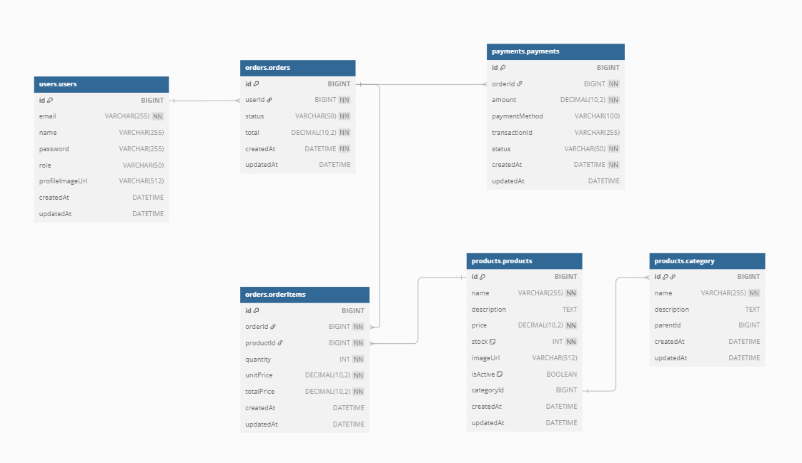

# Manna - E-commerce API

NestJS 기반의 전자상거래 API 서버입니다. 사용자 관리, 상품 관리, 주문 처리, 결제 시스템을 포함한 완전한 E-commerce 백엔드 솔루션을 제공합니다.

## 🚀 주요 기능

- **사용자 관리**: 회원가입, 로그인, JWT 인증
- **상품 관리**: 상품 CRUD, 카테고리 관리
- **주문 시스템**: 주문 생성, 상태 관리, 주문 내역 조회
- **결제 시스템**: 토스페이먼츠 연동, 다양한 결제 수단 지원
- **권한 관리**: Role-based Access Control (RBAC)

## 🛠 기술 스택

- **Framework**: NestJS 11.x
- **Language**: TypeScript 5.x
- **Database**: PostgreSQL
- **ORM**: TypeORM
- **Authentication**: JWT, Passport
- **API Documentation**: Swagger/OpenAPI
- **Validation**: class-validator, class-transformer
- **Testing**: Jest

## 📦 요구사항

- Node.js 18.x 이상
- PostgreSQL 12.x 이상
- pnpm (권장) 또는 npm

## ⚡ 설치 및 실행

### 1. 저장소 클론
```bash
git clone <repository-url>
cd manna
```

### 2. 의존성 설치
```bash
pnpm install
```

### 3. 환경 변수 설정
`.env` 파일을 생성하고 다음 변수들을 설정하세요:

```env
# Database
DATABASE_HOST=localhost
DATABASE_PORT=5432
DATABASE_USERNAME=your_username
DATABASE_PASSWORD=your_password
DATABASE_NAME=manna_db
SYNCHRONIZE=true

# JWT
JWT_SECRET=your_jwt_secret_key

# Server
PORT=3000
NODE_ENV=development

# Payment (Toss Payments)
TOSS_PAYMENTS_SECRET_KEY=your_toss_secret_key
```

### 4. 데이터베이스 실행
PostgreSQL을 실행하고 데이터베이스를 생성하세요.

### 5. 애플리케이션 실행

**개발 모드:**
```bash
pnpm run start:dev
```

**프로덕션 모드:**
```bash
pnpm run build
pnpm run start:prod
```

## 📚 API 문서

애플리케이션 실행 후 다음 URL에서 Swagger API 문서를 확인할 수 있습니다:

```
http://localhost:3000/api-docs
```

## 🗄 데이터베이스 구조

### 주요 엔티티

#### Users (사용자)
- `id`: 기본 키
- `email`: 이메일 (고유)
- `password`: 암호화된 비밀번호
- `role`: 사용자 역할 (admin/user)
- `profile`: 프로필 정보

#### Products (상품)
- `id`: 기본 키
- `name`: 상품명
- `price`: 가격
- `description`: 상품 설명
- `quantity`: 재고 수량
- `category`: 카테고리 (관계)

#### Categories (카테고리)
- `id`: 기본 키
- `name`: 카테고리명
- `products`: 상품 목록 (관계)

#### Orders (주문)
- `id`: UUID 기본 키
- `userId`: 사용자 ID (관계)
- `totalAmount`: 총 주문 금액
- `status`: 주문 상태 (PENDING, PAID, PROCESSING, SHIPPING, DELIVERED, CANCELED, REFUNDED)
- `orderItems`: 주문 상품 목록 (관계)
- `payments`: 결제 정보 (관계)

#### OrderItems (주문 상품)
- `id`: 기본 키
- `productId`: 상품 ID (관계)
- `quantity`: 주문 수량
- `orderId`: 주문 ID (관계)

#### Payments (결제)
- `id`: UUID 기본 키
- `paymentKey`: PG사 결제 키
- `orderId`: 주문 ID (관계)
- `method`: 결제 수단 (CARD, VIRTUAL_ACCOUNT, TRANSFER, EASY_PAY, PHONE, POINT)
- `amount`: 결제 금액.;'pl-0'

## ERD



## 🔐 인증 및 권한

### JWT 인증
- JWT 토큰 기반 인증 시스템
- 토큰 만료 시간 설정 가능
- Role-based Access Control 지원

### 권한 레벨
- **ADMIN**: 모든 기능 접근 가능
- **USER**: 일반 사용자 기능만 접근 가능

## 💳 결제 시스템

### 지원 결제 수단
- 가상계좌
- 계좌이체
- 간편결제 (네이버페이, 카카오페이 등)

### 토스페이먼츠 연동
- 결제 요청 및 승인
- 결제 상태 조회
- 결제 취소 및 환불
- 부분 취소 지원

## 🧪 테스트

### 단위 테스트
```bash
pnpm run test
```

### E2E 테스트
```bash
pnpm run test:e2e
```

### 테스트 커버리지
```bash
pnpm run test:cov
```

## 🗂 프로젝트 구조

```
src/
├── auth/                 # 인증 모듈
│   ├── dto/             # 인증 관련 DTO
│   ├── jwt/             # JWT 가드
│   └── roles/           # 권한 관리
├── users/               # 사용자 관리
│   ├── dto/             # 사용자 관련 DTO
│   └── user.entity.ts   # 사용자 엔티티
├── products/            # 상품 관리
│   ├── dto/             # 상품 관련 DTO
│   └── entity/          # 상품 엔티티
├── orders/              # 주문 관리
│   ├── dto/             # 주문 관련 DTO
│   └── entities/        # 주문 엔티티
├── payments/            # 결제 관리
│   ├── dto/             # 결제 관련 DTO
│   ├── entities/        # 결제 엔티티
│   └── type/            # 결제 타입 정의
├── app.module.ts        # 루트 모듈
└── main.ts              # 애플리케이션 진입점
```

## 📝 개발 가이드

### 코드 스타일
- ESLint와 Prettier를 사용한 코드 포맷팅
- TypeScript strict 모드 활성화
- NestJS 컨벤션 준수

### 환경 변수 관리
- ConfigService를 통한 환경 변수 관리
- 개발/프로덕션 환경별 설정 파일 분리

### 데이터베이스 마이그레이션
- TypeORM을 사용한 자동 스키마 동기화
- 프로덕션 환경에서는 마이그레이션 파일 사용 권장

---

